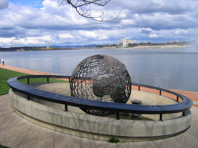
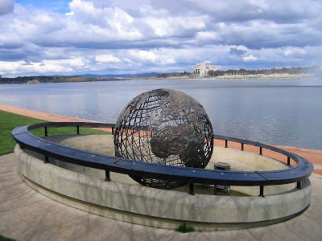
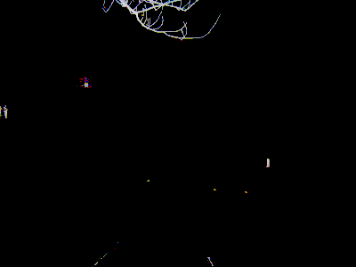

# imgcmp-rs

A simple pixel-wise image comparator written in Rust.

I wrote this small project to learn more about Rust by reimplementing a tool I wrote before in C++, which is [imgcmp](https://github.com/yahiaetman/imgcmp).

This should work the same as [imgcmp](https://github.com/yahiaetman/imgcmp), so I will skip the documentation. The only difference is that the exit code is 1 (instead of -1 in the C++ version) if the images don't match. If they match, the exit code is still 0.

## Example

    > imgcmp-rs image1.png image2.png -o difference.png -t 0.1 -v
    MISMATCH DETECTED
    Different Pixels: 1.0366666%

|  |  |  |
| :---: | :---: | :---: |
| `image1.png` | `image2.png` | `difference.png` |

Image source: [Globe and high court (Spot the difference).jpg](https://commons.wikimedia.org/wiki/File:Globe_and_high_court_(Spot_the_difference).jpg)